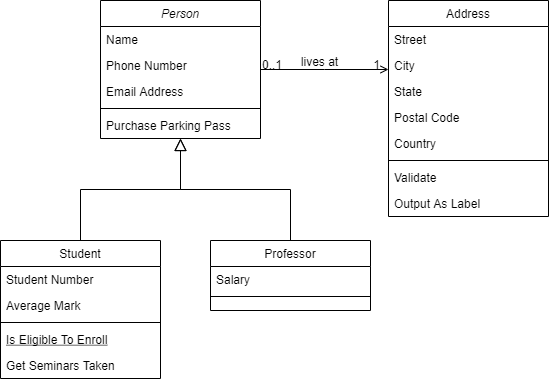

# Project-Fruit-Image-Classification
Digital Image Processing

#### Create your Own Image Classification Model using Python and Keras
https://www.analyticsvidhya.com/blog/2020/10/create-image-classification-model-python-keras/

#### Datasets
- https://www.kaggle.com/moltean/fruits
- License : CC BY-SA 4.0

<!--  -->

